---

  

### AI Developer & Vibecoder 🤖

Construindo o futuro com agentes de IA, código e prompts.

---

<!-- Metrics generated SVG - auto-updated daily by GitHub Actions -->

  

---

---

### 🛠️ Tech Stack

| Category | Tools |
|----------|-------|
| **AI Agents** | Claude, Gemini, GPT, Multi-Agent Systems |
| **Backend** | N8n, Supabase, Chatwoot, Evolution API |
| **Frontend** | React, TypeScript, Tailwind, shadcn/ui |
| **Platforms** | Lovable.dev, OpenRouter |
| **Automations** | N8n Workflows, WhatsApp/Telegram Bots |

---

### 📊 Projects

Multi-agent AI system for client service automation

---

  

